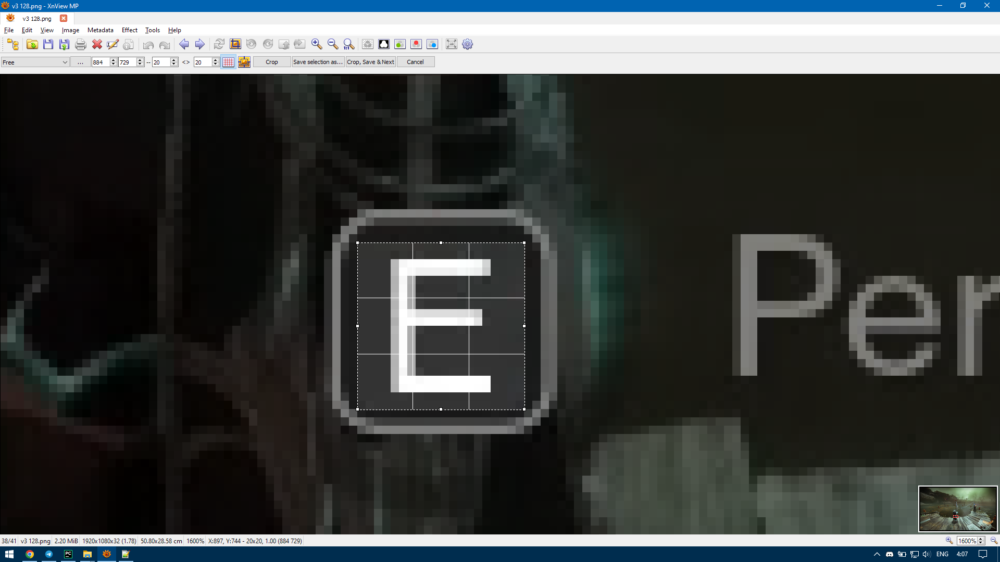
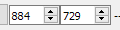
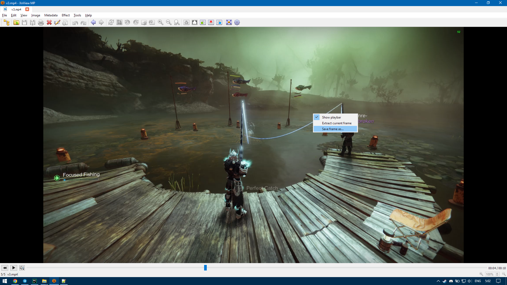

This guide describes how to create configuration file for any screen resolution,
localization and interaction button.

# Creating configuration file

In this guide I will use [XnView MP](https://www.xnview.com/en/xnviewmp/)
program to crop images and extract frames. You can use any other program or online tool
to achieve the same results.

1. Start fishing manually and make a screenshot
   when `Perfect catch` interaction is clearly visible.
    - A preferred way to make a screenshot is to use Destiny 2 hotkey for this.
      This hotkey is not listed in Destiny 2 settings and can be specified only
      if you store hotkeys locally. If you do not store hotkeys locally,
      or you never specified this hotkey, try `PrtScr` button. If there is in-game notification,
      then screenshot is made and located inside `Documents\Destiny 2\Screenshots` directory.
    - You can use `Win+PrtScr` to make a screenshot. The file will be saved inside
      `Pictures\Screenshots` directory.
    - You are also allowed to use any other way to make a screenshot available on your PC.

   *Note*: you can copy any path listed in the sub-list above, paste inside Explorer address bar
   and press Enter to quickly navigate to these directories on your PC.
2. Create somewhere an empty directory and open it in Explorer.
3. Click on the address bar, erase everything there, type `powershell` and press Enter.
    - Alternatively, you can click `File -> Run Windows PowerShell -> Run Windows PowerShell`.
4. Run `python -m destiny2autofishing -c .\config.toml`.
   This will generate a sample configuration file.
5. Open created configuration file with any text editor.
6. Replace some present `???` in front of option names with respective values from below.
    - `method_name` - put `'image'`.
    - `interact_key` - put your interaction key in lower case enclosed in quotes,
      for example, `'e'`.
    - `is_mouse_button` - put `false`. Support for mouse buttons is limited,
      it will be discussed in the section below.
7. Start cropping the screenshot from step 1 at the position of interaction key.
8. Once you decided on the position of the bounding box, take note of its X and Y coordinates.

   
   

   In this example the value for X is 884 and the value for Y is 729.
9. Put values for X and Y inside the configuration file.
    - `bbox_x0` - replace `???` with X value.
    - `bbox_y0` - replace `???` with Y value.
10. Complete cropping. Save the result as **a PNG image** to the directory
    with your configuration file.
11. Put name of the saved file inside the configuration file. Locate option
    `key_image_path` and replace `???` in front of it with the name of the saved file.
    The name must be enclosed in quotes, for example, `'E-image.png'`.
12. Specify tolerance value inside the configuration file. Locate option `tolerance`
    and replace `???` in front of it with `85`.
    This value can be adjusted as discussed in the section below.
13. Save changes made to the configuration file.

The configuration file is complete. You can use `python -m destiny2autofishing -c .\config.toml`
command to run the script with it. If you want to start the script from anywhere,
replace `.\config.toml` with the absolute path to this file:
press `Shift + Mouse Right Button` on `config.toml` to view the extended context menu
and click `Copy as path` to copy absolute path to the configuration file.

If you find difficult to make configuration by your own, then create an issue in
[issue tracker](https://github.com/Prometheus3375/destiny2-auto-fishing/issues)
with attached screenshot from step 1.

## Adding a mouse button as interaction key

Directly supported mouse buttons are `left`, `middle` and `right`.
If you are using these buttons as interaction key,
then specify respective button name in front of `interact_key` option
and set `is_mouse_button` to `true`.

If you are using any other mouse button, there is a workaround:

- Complete all steps from the guide above.
- In Destiny 2 settings set an *alternative button* for interaction command to any keyboard key.
- Set `interact_key` option inside configuration file to this key.

Since mouse button is the primary way to interact,
the game shows its image when interaction is available.
Thus, its image must be used by the script. But this button cannot be pressed by the script
because of library limitations; therefore, you need to set an alternative key in
game settings and specify this key instead of the mouse button.

## Adjusting tolerance

Tolerance value specifies how far the pixel values of a captured image can differ
from the pixel values of the image at `key_image_path` to trigger fish catch.
Usually the value of 85 is enough, but it is possible to estimate this value more precisely.

1. Record a video where you catch a fish. There should be at least 1 second before catch
   and 1 second after.
2. Extract several frames before `Perfect catch` interaction is clearly visible
   and several frames after. Save them as **PNG images** and put inside one directory.

   
3. Run `python -m destiny2autofishing.methods.image "key-image-path"
   -d "path-to-directory-with-extracted-frames"` where the first path
   is the path to the image of interaction key specified in the configuration file
   and the second one is the path to the directory with all extracted frames.
    - Run `python -m destiny2autofishing.methods.image --help`
      to view all available options of this sub-script.
4. You will see several `tolerance` values in the output. Pick the most appropriate one
   and set it for option `tolerance` inside your configuration file.
